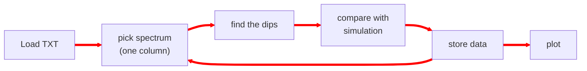

While getting into research the first thing that overwhelmes most is the literature survey. Initially it might seem like never ending. Each article will cite plenty of other articles to read for an overall understanding. Eventally it can be a real stuggle to keep track of what you have read and find a specific article in your mind. 

Over time you might remember keywords and images to search the article for digging the details. 
One good way to keep track of an article is to write a line or two about it under a broader topic and cite it. You can do it in a notebook/diary but with increasing number of articles and topics it might be difficult to navigate. 
Another thing is when you are discussing with someone you may have your computer infront of you rather than the diary for a quick search. Then if you want to write and share something it is 99% times digital so it might be faster if you have already something written digitally. Although nothing can beat pen and paper while connecting ideas or resolving complex queries.

During experiments you will generate a lot of data repeatitively, processing and visualizing them manually (Excel-Origin way) can be fustrating. You will get addicted to automation and workflows for faster understanding of data and be less boared once get used to writing codes/scripts. 

In this context I will give a glimpse of three free tools I found very useful while starting as a PhD student - 
- [Zotero](https://www.zotero.org/) - for collecting, navigating and citing articles
- [Zettlr](https://www.zettlr.com/) - for writing, conslidating topics with citations and cross referencing
- [Python](https://www.python.org/) and [VS Code](https://code.visualstudio.com/) - automating data processing and visualizations.

### Zotero
‘[Zotero](https://www.zotero.org/) is a free, easy-to-use tool to help you collect, organize, annotate, cite, and share research’. When you get a relevant paper just copy the doi and enter in Zotero, it will automatically fetch all details of the paper and if possible also the pdf in the Zotero library. You can have different libraries in Zotero for different research topics. 

The features I find attractive in Zotero -
- adding new papers just by entering DOI
- exporting citations for latex
- citing directly in MS Word
- integrated search bar
- intergrated pdf reader with higligting and note
- tagging
- RSS feeds for getting journal research updates
- auto update exported bib file with [BetterBibTex](https://retorque.re/zotero-better-bibtex/index.html)
- visualizing connection between the atricles with [Cita](https://github.com/zotero-cita/zotero-cita)
- multi device sync with account (but limited storge)

<div class="row mt-2 mb-1">
        {% include figure.liquid loading="eager" path="assets/img/blog/zotero_add_item.webp" max-width="90%" class="img-fluid rounded z-depth-1 mx-auto d-block" zoomable=true %}
</div>
<div class="caption">
    Adding citations in Zotero
</div>

<div class="row mt-1 mb-1 justify-content-center">
    
</div>

For getting more detalied use cases go through the [Zotero documentation](https://www.zotero.org/support/quick_start_guide)

-> [Better BibTeX (Zotero Plug-In) - LaTeX - LibGuides at University of Massachusetts Amherst](https://guides.library.umass.edu/c.php?g=1402580\&p=10705039)\\
-> [Wikidata's Cita page](https://www.wikidata.org/wiki/Wikidata:Zotero/Cita)

### Zettlr
While wrting in MS word, manging documents more than a few pages with figures and equations becomes fustrating. So, we go to latex for peaceful writing in a text editor and less bothered about the postions or numberings and finding symbols for equations. But in latex you need to compile the document you have written everytime you want to see the final result. While just jotting down a draft it might feel a lot of work and you go back to word. [Markdown](https://www.markdownguide.org/getting-started/) comes as a saviour with very minimal writing syntax but works like a live latex document. There are different markdown flavours available with few variations in syntax. 

For jotting down connected topics or ideas, and also writing aricles for publishing, [Zettlr](https://www.zettlr.com/) is a tool of comfort. Interstingly, whatever you write in Zettlr you can export to pdf, Word, latex, html and so on. It can serve as a primary drafiting station. Citations, equations, links, images, videos, tables, lists anything at ease. This page itself is written in Zettlr.

<div class="row mt-2 mb-1">
    
</div>
<div class="caption">
    Writing equation and symbols in Zettlr
</div>

Using a bibliography source file loaded you can seamlessly add citations inline - 
<div class="row mt-2 mb-1">
    
</div>
<div class="caption">
    Adding citations in Zettlr
</div>

<div class="row mt-1 mb-1 justify-content-center" >
    
</div>

Visit [Zettlr documentation page](https://docs.zettlr.com/en/) to explore the possibilities.

-> [Basic markdown sytax](https://www.markdownguide.org/basic-syntax/)\\
-> [Zettlr citations documentation](https://docs.zettlr.com/en/editor/citations/)\\
-> [Zotero and Zettlr integration](https://docs.zettlr.com/en/guides/reference-manager-integration/#)\\
-> [pandoc-crossref releases page](https://github.com/lierdakil/pandoc-crossref/releases/tag/v0.3.24a)

### Python and VS Code

Most of the times one experiment is repeated multiple times and the data has to be processed every time to understand the results, automating the process or atleast part of it makes the process significantly faster. For example, when I take a series of continuous spectrum to observe the chnages in an optical mode it is thousands of spectrum as column in the data as shown below. 
```math
# wl	 scan1	scan2		scan3	scan4		scan5	scan6 	scan7		scan8	scan9...
420.27	0.6294	0.63077	0.68675	0.62037	0.67407	0.65529	0.68027	0.66025	0.69008...
420.87	0.69319	0.61734	0.66561	0.71034	0.66313	0.7125	0.69145	0.67011	0.6864...
421.46	0.67991	0.68286	0.65843	0.66553	0.64906	0.64739	0.67605	0.67591	0.68637...
422.06	0.65386	0.63681	0.71062	0.67727	0.67607	0.64761	0.68161	0.63457	0.69282...
422.65	0.64531	0.6476	0.69234	0.6564	0.66911	0.67382	0.67398	0.68798	0.66124...
423.25	0.63986	0.66041	0.65199	0.65917	0.66475	0.63997	0.65185	0.67728	0.6418...
423.84	0.57841	0.58663	0.63932	0.62626	0.62668	0.62391	0.65501	0.62359	0.63286...
.
.
```

Plotting, finding the modes and their quanlity factor can be challenging without using a code. The left image shows the data as a colormap where y axis is going to be wavelengths and x axis is scan numbers. I want to find the quality factor of the modes, compare the spectra to simulation to find actual values of a parameter along x axis. Analyzing with graph plotting softwares will be a nightmare. Moreover, I have 20 such dataset to analyze! The right side image is the final processed spectra with modes traced and x axis labeled as thickness.

<div class="row mt-2 mb-1">
    <div class="col-sm-5 mt-3 mt-md-0">
        
    </div>
    <div class="col-sm-7 mt-2 mb-1 mt-md-0">
        
    </div>
</div>

For this the flow of code code is -  

The python packges need for this is [numpy](https://numpy.org/doc/stable/user/absolute_beginners.html), [scipy](https://docs.scipy.org/doc/scipy/tutorial/index.html#user-guide) and [matplotlib](https://matplotlib.org/) only. 

With the script ready for each new file we just have to enter the filepath and it will return the processed image and data. Some codes will be repeateadly used so you will develop your own functions or even library and import it in other scripts. Writing your first script might feel slow but the time it will save later is worth it. 
[Python](https://www.python.org/) is free and opensource programming language widely used for easy syntax, large range of available libraries to start with, large online communities and forums with Q&A. Whatever you imagine to do with the data you will find answer on web search. Once you install python try ```import antigravity```.

<div class="row mt-2 mb-1 justify-content-center">
  <div class="col-8">
    {% include figure.liquid loading="eager" path="assets/img/blog/import_antigravity.webp" class="img-fluid rounded z-depth-1"  max-width="60%" zoomable=true %}
  </div>
</div>

Also for generating repetitive publication quality plots custom plotting styles can be saved as `.mplstyle` and used while plotting.

Python is the interpreter but you have to write the code in a text editor and run it with python. The choice of the editor can make a difference how fast you can write a code and be less frustrated. With the variety of extensions and keyboard shortcuts it will be easy to maintain any size of code in [Visual studio code](https://code.visualstudio.com/) (VS code). If you want to work with [jupyter notebooks](https://docs.jupyter.org/en/latest/) vscode supports it. 

<div class="row mt-2 mb-1 justify-content-center">
  <div class="col-8">
    
  </div>
</div>


-> [Python for beginners](https://www.python.org/about/gettingstarted/)\\
-> [Customizing Matplotlib with style sheets and rcParams](https://matplotlib.org/stable/users/explain/customizing.html)\\
-> [SciencePlots](https://github.com/garrettj403/SciencePlots), [mpltex](https://github.com/liuyxpp/mpltex) [LovelyPlots](https://github.com/killiansheriff/LovelyPlots), 
-> [Quick Start Guide for Python in VS Code](https://code.visualstudio.com/docs/python/python-quick-start)\\
-> [vscode tips and tricks](https://github.com/microsoft/vscode-tips-and-tricks)

