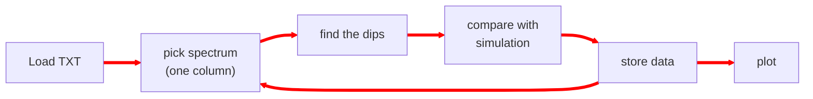

While getting into research, the first thing that overwhelms most is the literature survey. Initially, it might seem like it's never-ending. Each article will cite plenty of other articles to read for an overall understanding. Eventually, it can be a real struggle to keep track of what you have read and find a specific article in your mind. 

Over time, you might remember keywords and images to search for the article to dig deeper into the details. [Scopus](https://www.scopus.com), [Google Scholar](https://scholar.google.com/), or just a web search is utilized for finding articles.
One good way to keep track of an article is to write a line or two about it under a broader topic and cite it. You can do it in a notebook/diary, but with an increasing number of articles and topics, it might be difficult to navigate. 

Another practical issue is accessibility. When you are discussing with someone, you may have your computer in front of you rather than the diary for a quick search. Then, if you want to write and share something, it is 99% of the time digital, so it might be faster if you already have something written digitally. Although nothing can beat pen and paper while connecting ideas or resolving complex queries.

During experiments, you will generate a lot of data repeatedly, and processing and visualizing them manually (Excel-Origin way) can be frustrating. You will get addicted to automation and workflows for faster understanding of data, and be less bored once you get used to writing codes/scripts. 

In this context, I will give a glimpse of three free tools I found very useful while starting as a PhD student - 
- [Zotero](https://www.zotero.org/) - for collecting, navigating, and citing articles
- [Zettlr](https://www.zettlr.com/) - for writing, consolidating topics with citations and cross-referencing
- [Python](https://www.python.org/) and [VS Code](https://code.visualstudio.com/) - automating data processing and visualizations.

### Zotero
‘[Zotero](https://www.zotero.org/) is a free, easy-to-use tool to help you collect, organize, annotate, cite, and share research.’ When you get a relevant paper, just copy the DOI and enter it in Zotero; it will automatically fetch all details of the paper and, if possible, also the PDF in the Zotero library. You can have different libraries in Zotero for different research topics. 

The features I find attractive in Zotero -
- adding new papers just by entering the DOI
- exporting citations for $\LaTeX$
- citing directly in MS Word
- integrated search bar
- integrated PDF reader with highlighting and note-taking
- tagging
- RSS feeds for getting journal research updates
- auto update exported bib file with [BetterBibTex](https://retorque.re/zotero-better-bibtex/index.html)
- visualizing connection between the articles with [Cita](https://github.com/zotero-cita/zotero-cita)
- multi-device sync with account (but limited storage)

<div class="row mt-2 mb-1">
        {% include figure.liquid loading="eager" path="assets/img/blog/zotero_add_item.webp" max-width="90%" class="img-fluid rounded z-depth-1 mx-auto d-block" zoomable=true %}
</div>
<div class="caption">
    Adding citations in Zotero
</div>

<div class="row mt-1 mb-1 justify-content-center">
    
</div>

For getting more detailed use cases, go through the [Zotero documentation](https://www.zotero.org/support/quick_start_guide)

<i class="fa-solid fa-caret-right"></i> [Better BibTeX (Zotero Plug-In) - LaTeX - LibGuides at University of Massachusetts Amherst](https://guides.library.umass.edu/c.php?g=1402580\&p=10705039)\\
<i class="fa-solid fa-caret-right"></i> [Wikidata's Cita page](https://www.wikidata.org/wiki/Wikidata:Zotero/Cita)

### Zettlr
Writing long documents in MS Word, especially when you’ve got figures and equations, can make you :grimacing: :sob:! That’s why a lot of us switch to LaTeX. It makes writing long documents way easier since you don't have to stress about formatting, numbering, or hunting for symbols for equations.

But in LaTeX, you need to compile the document you have written every time you want to see the final result. While just jotting down a draft, it might feel like a lot of work, and you go back to Word. [Markdown](https://www.markdownguide.org/getting-started/) comes as a saviour with very minimal writing syntax, but works like a live LaTeX document. There are different Markdown flavours available with a few variations in syntax. 

For jotting down connected topics or ideas, and also writing articles for publishing, [Zettlr](https://www.zettlr.com/) is a tool of comfort. Interestingly, whatever you write in Zettlr, you can export to PDF, Word, LaTeX, HTML, and so on. It can serve as a primary drafting station. Citations, equations, links, images, videos, tables, lists, anything at ease. This page itself is written in Zettlr.

<div class="row mt-2 mb-1">
    
</div>
<div class="caption">
    Writing equation and symbols in Zettlr
</div>

Using a bibliography source file loaded, you can seamlessly add citations inline - 
<div class="row mt-2 mb-1">
    
</div>
<div class="caption">
    Adding citations in Zettlr
</div>

<div class="row mt-1 mb-1 justify-content-center" >
    
</div>

Visit [Zettlr documentation page](https://docs.zettlr.com/en/) to explore the possibilities.

<i class="fa-solid fa-caret-right"></i> [Basic markdown sytax](https://www.markdownguide.org/basic-syntax/)\\
<i class="fa-solid fa-caret-right"></i> [Zettlr citations documentation](https://docs.zettlr.com/en/editor/citations/)\\
<i class="fa-solid fa-caret-right"></i> [Zotero and Zettlr integration](https://docs.zettlr.com/en/guides/reference-manager-integration/#)\\
<i class="fa-solid fa-caret-right"></i> [pandoc-crossref releases page](https://github.com/lierdakil/pandoc-crossref/releases/tag/v0.3.24a)

### Python and VS Code

Most of the time, an experiment is repeated multiple times, and the data have to be processed after every run to properly understand the results. Automating the process, or at least parts of it, makes the workflow significantly faster. For example, when I record a series of continuous spectra to observe changes in an optical mode, the experiment generates thousands of spectra stored as columns in the dataset, as shown below.

```math
# wl    scan1	scan2	scan3	scan4	scan5	scan6 	scan7	scan8	scan9...
420.27	0.6294	0.63077	0.68675	0.62037	0.67407	0.65529	0.68027	0.66025	0.69008...
420.87	0.69319	0.61734	0.66561	0.71034	0.66313	0.7125	0.69145	0.67011	0.6864...
421.46	0.67991	0.68286	0.65843	0.66553	0.64906	0.64739	0.67605	0.67591	0.68637...
422.06	0.65386	0.63681	0.71062	0.67727	0.67607	0.64761	0.68161	0.63457	0.69282...
422.65	0.64531	0.6476	0.69234	0.6564	0.66911	0.67382	0.67398	0.68798	0.66124...
423.25	0.63986	0.66041	0.65199	0.65917	0.66475	0.63997	0.65185	0.67728	0.6418...
423.84	0.57841	0.58663	0.63932	0.62626	0.62668	0.62391	0.65501	0.62359	0.63286...
.
.
```
Plotting the spectra, identifying the modes, and calculating their quality factors can be challenging without using code. The left image shows the raw data as a colormap, where the y-axis represents wavelength and the x-axis represents scan number. From this data, I want to determine the quality factors of the modes and compare the spectra with simulations to extract the actual values of a parameter along the x-axis. Doing this manually using graph-plotting software would be a nightmare — especially when I have around 20 such datasets to analyze! The image on the right shows the final processed spectra, with the modes traced and the x-axis labeled as thickness.

<div class="row mt-2 mb-1 justify-content-center">
    <div class="col-sm-3 mt-3 mt-md-0">
        
    </div>
    <div class="col-sm-5 mt-2 mb-1 mt-md-0">
        
    </div>
</div>

For this the flow of code code is -  

The Python packages needed for this are [NumPy](https://numpy.org/doc/stable/user/absolute_beginners.html), [SciPy](https://docs.scipy.org/doc/scipy/tutorial/index.html#user-guide), and [Matplotlib](https://matplotlib.org/) only.

Once the script is ready, for every new dataset you simply need to provide the file path, and the script will return the processed plots and extracted data automatically. Some pieces of code will be used repeatedly, so over time you will start developing your own functions or even small libraries that can be imported into other scripts. Writing your first script may feel slow and frustrating, but the time it saves later is absolutely worth it.

[Python](https://www.python.org/) is a free and open-source programming language widely used because of its simple syntax, extensive collection of libraries, and large online community with active forums and Q&A resources. Whatever you want to do with your data, chances are someone has already discussed it online. Once you install Python, try running -
```python
import antigravity
```

<div class="row mt-2 mb-1 justify-content-center">
  <div class="col-10">
    {% include figure.liquid loading="eager" path="assets/img/blog/import_antigravity.webp" class="img-fluid rounded z-depth-1"  max-width="80%" zoomable=true %}
  </div>
</div>

Also, for generating repetitive publication-quality plots, custom plotting styles can be saved as `.mplstyle` files and reused while plotting.

Python is the interpreter, but you still need a text editor to write and run the code. The choice of editor can significantly affect how quickly you can write code and how frustrated you feel while working. With its wide range of extensions and keyboard shortcuts, [Visual Studio Code](https://code.visualstudio.com/) (VS Code) makes it easier to manage projects of any size. If you want to work with [Jupyter notebooks](https://docs.jupyter.org/en/latest/), VS Code supports them seamlessly.

<div class="row mt-2 mb-1 justify-content-center">
  <div class="col-12">
    
  </div>
</div>

<i class="fa-solid fa-caret-right"></i> [Python for beginners](https://www.python.org/about/gettingstarted/)\\
<i class="fa-solid fa-caret-right"></i> [Customizing Matplotlib with style sheets and rcParams](https://matplotlib.org/stable/users/explain/customizing.html)\\
<i class="fa-solid fa-caret-right"></i> [SciencePlots](https://github.com/garrettj403/SciencePlots), [mpltex](https://github.com/liuyxpp/mpltex), [LovelyPlots](https://github.com/killiansheriff/LovelyPlots)\\
<i class="fa-solid fa-caret-right"></i> [Quick Start Guide for Python in VS Code](https://code.visualstudio.com/docs/python/python-quick-start)\\
<i class="fa-solid fa-caret-right"></i> [vscode tips and tricks](https://github.com/microsoft/vscode-tips-and-tricks)

